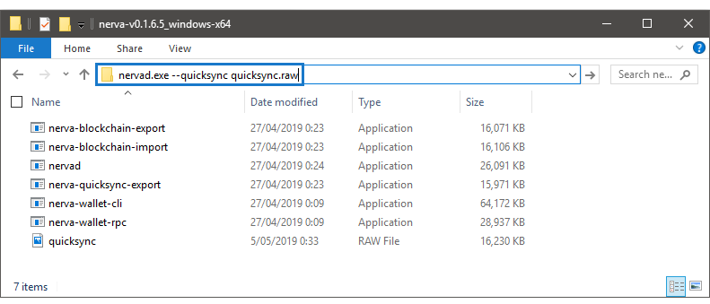
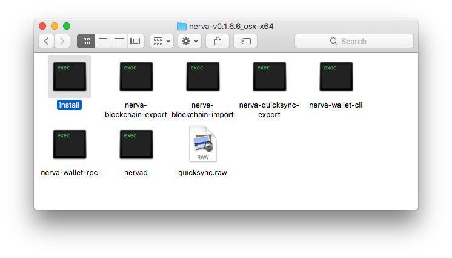
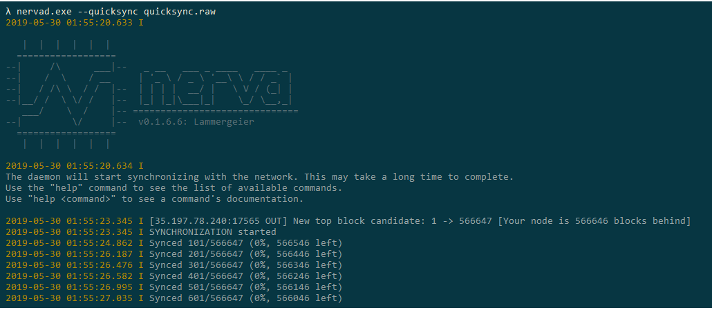
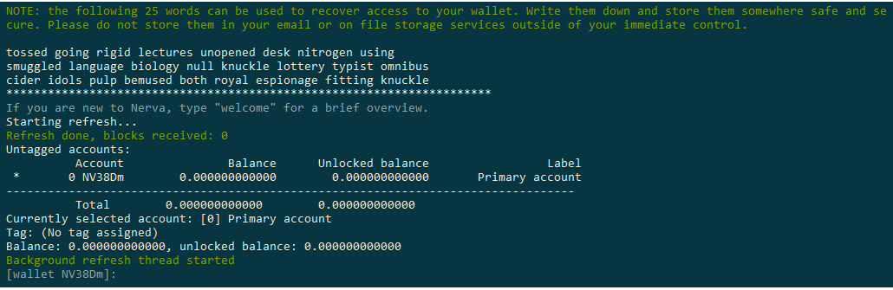

# NERVA CLI Guide
Running NERVA from the command-line gives you the most features, flexibility and stability, and is recommended for crypto veterans and newbies alike. If you're a less technical user and aren't familiar with the command-line, we know this can be intimidating at first. In truth, it's easy and you'll be a pro in no time at all. No prior knowledge is assumed in this guide, except basic computer skills. Let's get started!

## Getting started
NERVA consists of 2 primary components:

**nervad** is the NERVA daemon. This is your node, your connection to the NERVA network. nervad manages your network connections, the blockchain and is the software you can use to mine.

**nerva-wallet-cli** is the wallet program for NERVA. nerva-wallet-cli manages your balances, accounts and transfers of funds. *In order to make use of the wallet, nervad must also be running.*

There are other programs which are part of NERVA, but these are only used in specific circumstances.

To get these programs, open the [NERVA downloads page](https://getnerva.org/#downloads) and download the latest CLI files for your operating system. Optionally, you can also download the quicksync file - this will save you a lot of time. Then follow the instructions below for your specific operating system:

#### Getting started: Windows
**Tip for Windows users:** [Cmder](https://cmder.net/) is an alternative command prompt which improves the CLI experience. It is not required but is being used in the screenshots in this guide.

1. Open your Downloads folder and extract the contents of `nerva-vx.x.x.x_windows-x64.zip` into a new folder. You can move this new folder wherever you'd like NERVA to be stored on your computer (for example, on your desktop) or just leave it where it is.

2. (Optional) Move the `quicksync.raw` file we downloaded earlier into your NERVA folder.

3. Inside your NERVA folder, click on the path/address bar at the top of the window (see screenshot) and type in:
`nervad.exe --quicksync quicksync.raw`, then hit enter.

*If you are not using quicksync, simply double click on `nervad.exe`*
 

If you get a pop-up from Windows Firewall or any other security software, make sure to click 'Allow'. You are now running nervad. In the future you can launch it by simply double-clicking on `nervad.exe`, and you can launch the wallet by double-clicking `nerva-wallet-cli.exe`.

#### Getting started: macOS
1. Open Finder and go to your Downloads folder. Right click on the `nerva-vx.x.x.x_osx-x64.zip` file and select **Open With > Archive Utility**. This should automatically extract the contents into a new folder with the same name.
 *If you downloaded the file with Safari, it may have automatically been extracted.*

2. *(Optional)* Drag the `quicksync.raw` file into this new folder, and then open the folder. You should see an `install` file in here, but **don't open it yet**.
 

3. Open Terminal (by pressing Command + Space, then type `terminal` and hit enter).
 In the terminal window, we are going to type in `sudo` followed by a space. Now drag the `install` file from Finder into your Terminal window, and it should automatically add the location of the file to our command. Then hit enter to run the command.

4. You will be prompted for your Mac user account password. Type your password, and then hit enter. No dots will appear as you type the password - this is normal.
 **If at this or any point you receive a warning about running software from an unidentified developer, you need to open your System Preferences > Security & Privacy > General, and hit allow at the bottom of that page.**

5. If nothing happened except a new line in the terminal, the installation was successful. Now we will type another command:
  `nervad --quicksync` followed by a space and this time drag the `quicksync.raw` file into Terminal. Now hit enter. (*If you are not using quicksync, simply type `nervad`*)

You are now running nervad. In the future you can relaunch it by typing `nervad` in any Terminal window, and can launch the wallet with the command `nerva-wallet-cli`. You can open multiple terminals by clicking **Shell > New Terminal** from the top menu bar.

#### Getting started: Linux
1. Download and unzip the Linux binaries into a new directory, and move the `quicksync.raw` file there.

2. Run the command `./nervad --quicksync quicksync.raw` (*If you are not using quicksync, simply run `./nervad`*)

You are now running nervad. In the future you can relaunch it via the `./nervad` command. You can launch the wallet with the command `./nerva-wallet-cli`.

## Running the daemon
Once all the necessary processes have booted up, the NERVA daemon will check how far along your copy of the blockchain is. If it finds that your copy of the database has not caught up to the current block, it will tell you how far behind you are. After that, it will start synchronizing your chain with those of the peers you connect to. *Synchronizing* refers to the daemon keeping an up to date copy of the blockchain on your computer. Your daemon must have a full copy of the blockchain to work properly. You cannot mine and your wallet balance will not be accurate unless the blockchain is synchronized.

This process will take a while. If you have opted to use the quicksync feature, the sync should be completed in less than 20 minutes on most computers. Once your daemon has synchronised, you will receive a `SYNCHRONIZED OK` message and you then are ready to start using NERVA.

#### Understanding daemon messages
* Every announcement has a **time stamp**: `YYYY-MM-DD` followed by `HH:MM:SS.sss` (yes, miliseconds).
* `INFO` (`I`) is a [log level](#changing-log-level) indicator. Other possibilities are `WARNING` (`W`) and `ERROR` (`E`). Only errors require you to take action, as they indicate a problem. It is usually safe to ignore warnings.
* The **message** explains the event of interest.

If you run nervad with an increased [log level](#changing-log-level), you'll see a lot of messages while the daemon starts up all the necessary processes. The first few lines initialize the CryptoNote core module, which is the base protocol of all CryptoNote coins. The lines after that are all about booting up the servers required for accepting network requests and Remote Procedure Call (RPC) requests, which basically means the peer-to-peer stuff on the network or in simpler terms: this lets your computer talk to other computers on the NERVA network.

## Creating a wallet
*If you wish to store your funds on a Ledger hardware wallet, refer to the [Ledger guide](../ledger/).*

Once you have synchronized the blockchain, you'll need to create a wallet so that can you receive and spend NERVA. This is done through nerva-wallet-cli.

The wallet creation process is straightforward. After launching nerva-wallet-cli, you'll be asked to specify a wallet name. You should use *only* alphanumeric characters (a-z,A-Z,0-9). Then confirm wallet creation by typing Yes and hitting enter.

Next you'll be asked for a wallet password. The password you enter will be used to encrypt your wallet data, so that even if somebody else had access to your computer, your funds would remain safe (at least until/unless they brute forced the password). You *can* skip providing a password by just hitting enter, but it's recommended to enter a secure random password at this stage. You'll be required to enter this password whenever you open your wallet, when you spend coins and (by default) also when you receive coins. *Nothing will appear on the screen as you type your password - this is normal.*

Finally, specify your language (1 for English) and your wallet is all set up.

#### Backing up your seed
It is **extremely important** that you write down your unique 25 word seed phrase. These words are all that is needed to access your funds should your wallet file become lost or corrupted. **DO NOT** save the seed on your computer or any unencrypted digital storage. Ideally you should not print it either. The generally recommended method is to write your seed in block letters on old fashioned paper, and store it in a secure place.

It may seem obvious but is worth repeating: **NEVER share your seed with anybody else.** Your seed is the key to your funds, and anybody who has your seed can steal your funds.

You can optionally choose to backup your private view key and spend key. **Only the seed phrase is required.** You can view these at a later date with the commands `seed`, `viewkey` and `spendkey`.

#### What are all these seeds/keys?
There are 2 sets of keypairs in NERVA. The view key and spend key. Each pair consists of a public key and a private key.

To place it in basic terms, the public spend and view keys are combined to form your wallet address. People use that information to send you funds. However due to the private nature of Monero and its forks (NERVA included), funds are not actually sent to you. The transaction is encrypted with your public key and stored in the blockchain. Your wallet then scans the blockchain with your private keys to figure out which of these encrypted transactions belongs to you. When it finds a matching transaction, the information is stored in your wallet and your balance is updated.

Therefore, your wallet file is really nothing more than a cache for storing information about your transactions on the blockchain. The real work is done by the view and spend keys. And this is why it is of absolute importance to keep a copy of these keys safe. Without them, you cannot find your transactions on the blockchain and they are gone forever.

The 25 word mnemonic seed is the private view and spend keys combined in a human readable form. It is a convenience option to recover your wallet. Both the CLI and GUI wallet will provide you a way to recover your funds from the seed, or from the private keys.

## Restoring a wallet
You can open a previously created wallet by simply launching nerva-wallet-cli and typing the name of the wallet.
If the wallet file was lost or corrupted, or you have forgotten the password, you will need to restore the wallet through one of these methods:

#### Restore from 25 word mnemonic seed
You can restore from seed with the following command: `nerva-wallet-cli --restore-deterministic-wallet`

Set a name for your wallet, then carefully input your 25 word seed.
You will be asked to enter the seed encryption passphrase - usually there is no passphrase, so just hit enter. Then enter a strong password for the wallet, as if you were creating a new one.
Finally you'll be asked to enter a block height to scan your wallet from. If you're not sure, just press enter again. The wallet will then be regenerated.

#### Restore from private spend key
You can restore from the spend key with the following command: `nerva-wallet-cli --generate-from-spend-key <name>`

Replace `<name>` with the name you'd like your restored wallet to have.
You'll be prompted to enter your (secret) spend key. Carefully type it in.
Next choose a strong password for your wallet and confirm it, then choose your language (1 for English).
Finally you'll be asked to enter a block height to scan your wallet from. If you're not sure, just press enter again. The wallet will then be regenerated.

## Basic usage
**In both nervad and nerva-wallet-cli, you can see a full list of commands with `help`, and more information on a given command with `help <command>`.** Some commands are explained in further detail below.

You can view your public address (that you can receive funds to) with the wallet command `address`. You can see your current balance with `balance`.

#### Making transactions
No currency is complete without a way to spend it. nerva-wallet-cli provides the means to transfer funds to other accounts. The most basic way to send funds is to use the command: `transfer <address> <amount>`, where `address` is the address to send XNV to and `amount` is the amount to send. After you press ENTER, you will be informed of the fee and asked to confirm. Confirm the transaction to send.

There are other options when it comes to sending XNV. The following command includes some of the optional features: `transfer <priority> <address> <amount> <payment_id>`

Additional to `address` and `amount`, you now also have a `priority` which specifies the importance of the transaction and a `payment_id` which may optionally be required by the receiving party. There are 4 priority levels:

- default
- low
- medium
- high

Higher priority transactions are processed before lower priority transactions, however they cost more in fees. In most cases, the `default` priority (automatically set when you omit the priority) is suitable. Transaction fees collected are placed into the next block and included as part of the block reward for the miner of the next block.

The payment ID is an optional identifier used to label a transaction. This is most often used to distinguish who is sending funds to a particular wallet. For example, exchanges listing NERVA have only one address, and use the payment ID to determine which user is depositing funds to the exchange. Usually, exchanges use an [*integrated address*](#concerning-addresses).

#### Viewing transactions
You can use the `show_transfers` command in nerva-wallet-cli to see your transaction history (both sent and received).

Your wallet will automatically detect any new transactions, but if it doesn't (for example if it previously lost connection to nervad) you can manually refresh it with the `refresh` command. You can also fully rescan the blockchain with the command `rescan_bc` which will usually resolve any wallet issues.

#### Checking node status
In nervad, type the following command: `status`

This will produce an output such as:
`Height: 93582/93582 (100.0%) on mainnet, mining at 607 H/s, net hash 365.58 kH/s, v6, up to date, 8(out)+0(in) connections, uptime 0d 5h 35m 18s`

This shows you the height, network you are connected to, hash rate, number of connections and uptime. This comprises most information a user might require about the NERVA network.

#### Exiting
You should always use the `exit` command to safely close both nervad and nerva-wallet-cli.

## Mining
Mining is the process of validating transactions on the blockchain. The reward for your work is paid out in NERVA (XNV). If you are first to unlock the block, you get the coins. There are two ways to start mining:

* In `nerva-wallet-cli`, with the command `start_mining <threads>` - this will mine to your wallet address
* In `nervad`, with the command `start_mining <address> <threads>`

You can also set nervad to mine automatically after launching, with the command:
`nervad --start-mining <address> --mining-threads <threads>`

If you do not specify a number of CPU threads to mine on, the daemon will automatically detect the optimal number of threads, but you may get better results from experimentation, as each hardware configuration is different. If you have no idea what a thread is, or have other questions about mining, refer to the [Mining FAQ](../mining).

## Things to consider & FAQ
#### Concerning Nethash

As mentioned earlier, when you type `status` in the daemon one of the things you see is the network's total hashrate; this value is only an estimate, and so it can depart from the true network hashrate, which cannot be directly observed. The nethash value you see derives from the recent rate at which blocks have been produced. Consequently, luck may cause the nethash reading to fluctuate substantially, even if the real network hashrate hasn't changed at all.

An example: Blocks get found quickly, so it looks like the total nethash has increased; the estimate adjusts to compensate, then blocks slow down and it looks like nethash has decreased.

#### Concerning Addresses

NERVA has different types of addresses:
A **normal address** for NERVA starts with `NV`. If you send coins to an exchange or a merchant you have to add a payment ID to this kind of address. Due to the untraceability of transactions, they will need this to know the payment comes from you. Alternatively, you can use an **integrated address** which starts with `Niz`. Don't ask how the Z got there. This is likely a wrongly configured prefix; when the chain launched with it, it stayed forever. Integrated addresses don't require a separate payment ID because it is...integrated into it. A third kind of address is a **subaddress**. This is what you get if you create more than one address for a wallet. Subaddresses start with `NS`. Subaddresses are the next generation of privacy enhancing address.

To summarize:

* **normal address**: starts with `NV`, can be combined with payment ID
* **integrated address**: starts with `Niz`, has an integrated payment ID, typically used by exchanges.
*  **subaddress**: starts with `NS`

#### Concerning Chain Reorganizations:

Nodes always broadcast what they think is the right block height but this is not necessarily the correct one.

* It used to happen a lot after hardforks that outdated nodes kept broadcasting their bad chain top block as the right one. This is no longer an issue (since the CN-A v3 algorithm) because outdated nodes now get blocked as soon as they send a bad block or announce their invalid version height.
* The other possibility is that two miners find a block simultaneously (a so called uncle block situation) and both get half the network behind 'their' chain. This creates a temporary fork and happens every so often (daily). It goes like this:

Miner A and Miner B find a block almost simultaneously and start broadcasting their solution. The nodes that think block A is the right block mine as if it was and the nodes that think block B is the right one also mine as if Miner B's chain is the right one. Both chains diverge for a time until the chain is able to determine which one has the most nodes working on it (calculated from cumulative difficulty). That becomes the right chain and everyone on the other chain gets their node "reorganised" onto the right one.

#### Concerning Seed Nodes

The seed nodes are the basic nodes in the NERVA network. When you start your daemon for the first time, it will connect to the seed nodes to get started. Seed nodes are really nothing special: They are IP addresses hardcoded into the daemon, so if you run out of connections, you know at least a few nodes you can contact. NERVA developers are actively looking at alternate ways of getting a list of nodes you can connect to because seed nodes introduce a certain level of centralization. DNS-based node lists and port scanning to find other nodes are several of the options that are being considered.

#### Concerning the Nodemap

NERVA has a [nodemap](https://map.getnerva.org) which shows you approximately where the full nodes are in the world. Isn't that bad for privacy? First and foremost, there is the possibility to opt-out by starting the daemon with the `--no-analytics` flag. Besides that, no personally identifiable information is being stored and you always have the option to run the node from behind a proxy or VPN if you are worried.  The analytics aren't really analytics either: it's a simple matter of geolocating IP addresses which anyone could do with their own node. In fact, a core member (syzygy) playing around with this is exactly how the node map came to be. The functionality was later added to explicitly support it in the daemon.

#### Log location
By default, log files are stored in the following locations:

* `C:\ProgramData\nerva` on Windows
* `~/.nerva` on Linux and macOS

You can change this with the `--log-file` launch paramater if you so wish.

#### Changing log level
If you're having a problem but aren't receiving any error or warning messages in the terminal or logs, it can be a bit of a guessing game to find out what is going on.

Increasing the log level will output much more information, which can help to identify issues. You can do this in both nervad and nerva-wallet-cli, with the command `set_log <level>`, or by launching them with the parameter `--log-level <level>`.

Replace `<level>` with a number from 0-4, with 0 being minimal information, and 4 being a constant stream of text. It is recommended to increment the number by 1 until you find what you are looking for.

#### How do I update?
Download the latest version and simply overwrite the existing files.

#### How do I sync even faster?
Syncing the NERVA blockchain from scratch is relatively fast, but there are several ways to speed it up significantly.
The preferred method is to use [quicksync](https://getnerva.org/content/bootstrap/quicksync.raw), as demonstrated in earlier in this guide. This is a small file which, once downloaded, will allow you to sync the full blockchain in around 20 minutes, with the command:

`nervad --quicksync <path/to/quicksync.raw>`.

An even faster method, especially useful if deploying NERVA to multiple machines, is to download the latest [full bootstrap](https://getnerva.org/content/bootstrap/mainnet.raw) and import this via the command:

`nerva-blockchain-import --input-file <path/to/mainnet.raw> --verify 0`

Excluding the time to download the bootstrap, the import process should take less than a minute.
**You'll need to run the import command twice to sync to the top block of the bootstrap.** You then only need to sync the remaining blocks that weren't included in the bootstrap file.

What's the difference between NERVA's quicksync method and a regular bootstrap? The bootstrap is a copy of all the blocks up to a certain point; it is possible to enable full block verification with a bootstrap file if you wish to do so.
Quicksync, on the other hand, is a binary file that contains all of the chain's block hashes up to a certain height. While quicksyncing, the block hashes are compared to what is in the quicksync file rather than being computed on the fly. That saves your daemon from hashing each block itself, which is what makes the synchronization quick. It doesn't fully bypass the verification process, only the slow part of hashing the block.  

#### What are node blocked messages?
Other nodes can be blocked from connecting to your node if they have mined an invalid block (i.e. are on a forked chain) or have possibly tampered with the code. You may also be blocked for being on a forked chain as well. NERVA also has specific measures in place to block other nodes if they report an incompatible software version (i.e. outdated software) or fail to report their version to the other nodes. These measures exist to protect the integrity of the blockchain and to ensure that all nodes are updated to a compatible version of the NERVA software. 

If you are worried about these errors, you should type `status` into your node. If you have connections to the network, then there is nothing to worry about. If it reports you have no connections, then it is highly probable that it is in fact your node that is blocked from the network.

## Common issues

#### AES-NI error
The official NERVA binaries require that your CPU supports the AES-NI instruction set. This is present in practically all modern CPU's but may be absent on older systems, causing this error. Be aware that it is not practical to mine on a non-AES CPU, and your hashrate will not be competitive. However, you can build NERVA from source if you wish to run the daemon anyway.

#### nervad will not launch or crashes after launching
The most common reason this occurs is if you already have another instance of nervad running in the background. If in doubt, try restarting your computer.

If this did not fix the issue, check [the logs](#log-location) for more information.

#### Node not syncing
There are a number of reasons this can occur. Following these steps should resolve it in most cases:

* Restart the daemon
* Restart your computer
* Check your system's clock. If you clock's time is off from the network time by more than the future time limit, the local daemon will reject the block.
* Ensure you are running the latest version of NERVA.
* It is possible your blockchain is corrupted or you are on a forked chain. Run this command:
`nerva-blockchain-import --pop-blocks 1000`, then restart the daemon again.
* You may have been blocked by the seed nodes. Waiting or changing your IP should resolve this, or you can unblock yourself in the #atom channel in Discord.

If you're still having issues, Discord is the right place to be so we can investigate further.

#### Wallet created prior to v0.1.5.6 will not open
You'll need to restore from seed.

#### MDB_READERS_FULL error
Launch nervad with the flag: `--db-readers 256`

Increase this number until you don't get the error any more.

#### (macOS) 'lazy symbol binding failed: Symbol not found: _clock_gettime'
The Mac CLI is built on Mojave. The minimum required version for running the Mac CLI is reported as Sierra. There is no plan to support versions older than that for mining on Mac.

If you have git installed, you may also try building from source: `git clone --recursive https://bitbucket.org/nerva-project/nerva && ./nerva/builder/mac`

#### (Linux) nerva-wallet-cli hangs on launch
Try launching the wallet with the flag `--daemon-ssl disabled`.

## Getting help
If you have questions that are not answered here or with the `help` command, remember that NERVA is very closely related to Monero, a larger project with more comprehensive documentation. Sometimes you'll be able to find an answer (quickly) by googling your question with 'monero' appended. Otherwise, please reach out on [Discord](https://discord.gg/xBHxnGN) (in the **#cli-help** channel), our community is active and helpful.
