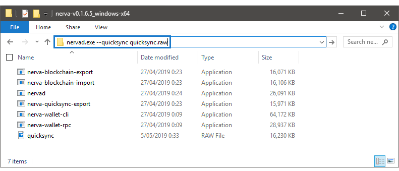
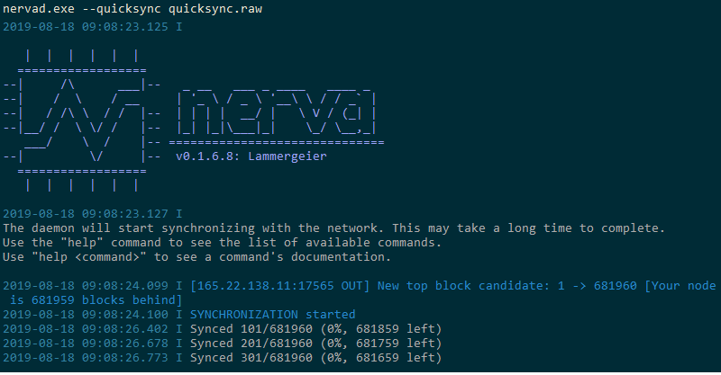
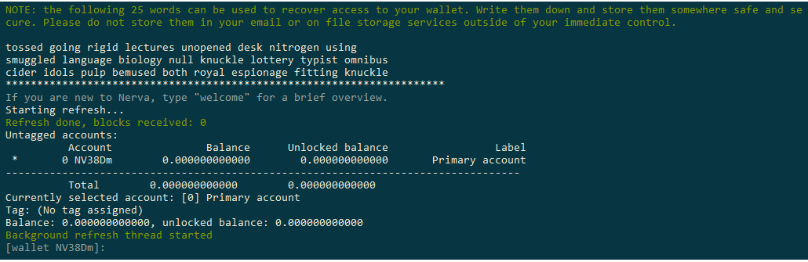

# NERVA CLI Guide
Running NERVA from the command-line is a good option for those familiar with commands and those who prefer simplicity over Graphical User Interfaces. Everything NERVA can do is available from the CLI, and it tends to be where new features land first. If you would rather point and click, have a look at the [NervaOne Guide](../nervaone) instead.

# Getting started
There are two binary packages per operating system available for download. The default minimal package contains the bare essentials for running a node and transacting on the network. The other package includes additional software. All downloads are available on [GitHub][nerva-github-nerva-releases-link]

NERVA consists of 2 primary components:

**nervad** is the NERVA daemon. This is your node, your connection to the NERVA network. nervad manages your network connections, the blockchain and is the software you can use to mine.

**nerva-wallet-cli** is the wallet program for NERVA. nerva-wallet-cli manages your balances, accounts and transfers of funds. *In order to make use of the wallet, nervad must also be running, unless you point it at a remote node* (more on that later).

There are other programs which are part of NERVA, such as nerva-wallet-rpc and the blockchain utilities, but these are only used in specific circumstances.

To get these programs, open the [NERVA downloads page][nerva-downloads-link] and download the latest CLI files for your operating system. Optionally, you can also download the `quicksync.raw` file published alongside each release, which will let you synchronize with the NERVA network much faster than downloading the chain block by block. Then follow the instructions below for your specific operating system.

## Getting started: Windows

1. Open your Downloads folder and extract the contents of `nerva-vx.x.x.x_windows-x64.zip` into a new folder. You can move this new folder wherever you'd like NERVA to be stored on your computer (for example, on your desktop) or just leave it where it is. A 32-bit build is provided for very old hardware.

2. (Optional) Move the `quicksync.raw` file we downloaded earlier into your NERVA folder.

3. Inside your NERVA folder, click on the path/address bar at the top of the window (see screenshot) and type in:
`nervad.exe --quicksync quicksync.raw`, then hit enter.

*If you are not using quicksync, simply double click on `nervad.exe`*
 

If you get a pop-up from Windows Firewall or any other security software, make sure to click 'Allow'. You are now running nervad. In the future you can launch it by simply double-clicking on `nervad.exe`, and you can launch the wallet by double-clicking `nerva-wallet-cli.exe`.

## Getting started: macOS
1. There are two builds of the CLI, one for Apple Silicon (armv8) and one for Intel (x64). If you are not sure which CPU your Mac has, click the Apple menu in the top left corner and select **About This Mac** — the chip or processor line will tell you. Download the appropriate file for your computer.

2. Open Finder and go to your Downloads folder. Right click on the `.tar.bz2` file you downloaded and let Archive Utility extract it into a new folder with the same name. *If you downloaded the file with Safari, it may have been extracted automatically.* You can also unpack it from a terminal with `tar -xjf nerva-vx.x.x.x_macos-armv8.tar.bz2`.

3. *(Optional)* Drag the `quicksync.raw` file into this new folder.

4. Open Terminal (press Command + Space, then type `terminal` and hit enter). Type `cd` followed by a space, then drag the folder you just extracted from Finder into the Terminal window (this pastes its path) and hit enter. Now type:
 `./nervad --quicksync quicksync.raw` and hit enter. (*If you are not using quicksync, simply type `./nervad`*)

 **If you receive a warning about running software from an unidentified developer, open System Settings > Privacy & Security and click Allow Anyway at the bottom of that page.** Each program may ask once the first time you run it.

You are now running nervad. In the future you can relaunch it by running `./nervad` from that folder in a Terminal window, and the wallet with `./nerva-wallet-cli`. You can open more terminals by clicking **Shell > New Terminal** in the top menu bar. If you want to run the programs from anywhere without navigating to the folder first, copy them somewhere in your PATH, such as `/usr/local/bin`.

## Getting started: Linux
1. Download the release archive for your architecture and unpack it into a new directory, for example `tar -xjf nerva-vx.x.x.x_linux-x86_64.tar.bz2`. ARM boards can use the armv7 or armv8 builds depending on the board. The `musl` builds are fully static and run on any distribution, which is handy if yours is exotic enough that the regular builds complain.

2. *(Optional)* Move the `quicksync.raw` file there, then run the command `./nervad --quicksync quicksync.raw` (*If you are not using quicksync, simply run `./nervad`*)

You are now running nervad. In the future you can relaunch it via the `./nervad` command from that directory. You can launch the wallet with the command `./nerva-wallet-cli`.

If you plan on keeping a node running long term, consider running it under systemd or inside a `tmux`/`screen` session so it survives your terminal closing. People who prefer containers can run the official Docker image instead, published for `linux/amd64` and `linux/arm64` with each release.

#### Verifying your download
Each release ships a `hashes.txt` along with a GPG signature over it. If you care about running the code you actually downloaded, and you should, verify the archive against `hashes.txt` with `sha256sum -c` on Linux and macOS (or a checksum tool of your choice on Windows), and check the signature against the public key published in the [nerva repository][nerva-github-nerva-link].

## Running the daemon
Once all the necessary processes have booted up, the NERVA daemon will check how far along your copy of the blockchain is. If it finds that your copy of the database has not caught up to the current block, it will tell you how far behind you are. After that, it will start synchronizing your chain with those of the peers you connect to. *Synchronizing* refers to the daemon keeping an up to date copy of the blockchain on your computer. Your daemon must have a full copy of the blockchain to work properly. You cannot mine and your wallet balance will not be accurate unless the blockchain is synchronized.

This process will take a while. Recent versions skip proof of work verification for old blocks during the initial sync, so a full sync from scratch is far quicker than it used to be, and with quicksync it typically finishes in minutes rather than hours. Once your daemon has synchronised, you will receive a `SYNCHRONIZED OK` message and you then are ready to start using NERVA.

The daemon talks to the network over port **17565**, and its local RPC interface listens on **17566**. If you run a firewall, make sure 17565 is open for both incoming and outgoing traffic, otherwise your node will struggle to find and keep peers.

#### Understanding daemon messages
* Every announcement has a **time stamp**: `YYYY-MM-DD` followed by `HH:MM:SS.sss` (yes, milliseconds).
* `INFO` (`I`) is a [log level](#changing-log-level) indicator. Other possibilities are `WARNING` (`W`) and `ERROR` (`E`). Only errors require you to take action, as they indicate a problem. It is usually safe to ignore warnings.
* The **message** explains the event of interest.

If you run nervad with an increased [log level](#changing-log-level), you'll see a lot of messages while the daemon starts up all the necessary processes. The first few lines initialize the CryptoNote core module, which is the base protocol of all CryptoNote coins. The lines after that are all about booting up the servers required for accepting network requests and Remote Procedure Call (RPC) requests, which basically means the peer-to-peer stuff on the network or in simpler terms: this lets your computer talk to other computers on the NERVA network.

## Creating a wallet
*If you wish to store your funds on a Ledger hardware wallet, refer to the [Ledger guide](../ledger/).*

Once you have synchronized the blockchain, you'll need to create a wallet so that can you receive and spend NERVA. This is done through nerva-wallet-cli. Technically the wallet only scans the chain, so it can be created before the sync is finished, but the balance it shows will not be complete until the daemon is caught up.

The wallet creation process is straightforward. After launching nerva-wallet-cli, you'll be asked to specify a wallet name. You should use *only* alphanumeric characters (a-z,A-Z,0-9). Then confirm wallet creation by typing Yes and hitting enter.

Next you'll be asked for a wallet password. The password you enter will be used to encrypt your wallet data, so that even if somebody else had access to your computer, your funds would remain safe (at least until/unless they brute forced the password). You *can* skip providing a password by just hitting enter, but it's recommended to enter a secure random password at this stage. You'll be required to enter this password whenever you open your wallet, when you spend coins and (by default) also when you receive coins. *Nothing will appear on the screen as you type your password - this is normal.*

Finally, specify your language (1 for English) and your wallet is all set up. The wallet file and a `.keys` file holding the encrypted private keys are written to whatever directory you launched the wallet from. Back those files up if you like, but remember the seed phrase below is what actually matters, and the blockchain itself is not part of the wallet, it lives in the daemon's data directory.

#### Backing up your seed
It is **extremely important** that you write down your unique 25 word seed phrase. These words are all that is needed to access your funds should your wallet file become lost or corrupted. **DO NOT** save the seed on your computer or any unencrypted digital storage. Ideally you should not print it either. The generally recommended method is to write your seed in block letters on old fashioned paper, and store it in a secure place.

It may seem obvious but is worth repeating: **NEVER share your seed with anybody else.** Your seed is the key to your funds, and anybody who has your seed can steal your funds.

You can optionally choose to backup your private view key and spend key. **Only the seed phrase is required.** You can view these at a later date with the commands `seed`, `viewkey` and `spendkey`.

#### What are all these seeds/keys?
There are 2 sets of keypairs in NERVA. The view key and spend key. Each pair consists of a public key and a private key.

To place it in basic terms, the public spend and view keys are combined to form your wallet address. People use that information to send you funds. However due to the private nature of Monero and its forks (NERVA included), funds are not actually sent to you. The transaction is encrypted with your public key and stored in the blockchain. Your wallet then scans the blockchain with your private keys to figure out which of these encrypted transactions belongs to you. When it finds a matching transaction, the information is stored in your wallet and your balance is updated.

Therefore, your wallet file is really nothing more than a cache for storing information about your transactions on the blockchain. The real work is done by the view and spend keys. And this is why it is of absolute importance to keep a copy of these keys safe. Without them, you cannot find your transactions on the blockchain and they are gone forever.

The 25 word mnemonic seed is the private view and spend keys combined in a human readable form. It is a convenience option to recover your wallet. Both the CLI and GUI wallet will provide you a way to recover your funds from the seed, or from the private keys.

# Restoring a wallet
You can open a previously created wallet by simply launching nerva-wallet-cli and typing the name of the wallet.
If the wallet file was lost or corrupted, or you have forgotten the password, you will need to restore the wallet through one of these methods:

#### Restore from 25 word mnemonic seed
You can restore from seed with the following command: `nerva-wallet-cli --restore-deterministic-wallet`

Set a name for your wallet, then carefully input your 25 word seed.
You will be asked to enter the seed encryption passphrase - usually there is no passphrase, so just hit enter. Then enter a strong password for the wallet, as if you were creating a new one.
Finally you'll be asked to enter a block height to scan your wallet from. If you're not sure, just press enter again. The wallet will then be regenerated.

#### Restore from private spend key
You can restore from the spend key with the following command: `nerva-wallet-cli --generate-from-spend-key <name>`

Replace `<name>` with the name you'd like your restored wallet to have.
You'll be prompted to enter your (secret) spend key. Carefully type it in.
Next choose a strong password for your wallet and confirm it, then choose your language (1 for English).
Finally you'll be asked to enter a block height to scan your wallet from. If you're not sure, just press enter again. The wallet will then be regenerated.

#### A note on restore height
When restoring, the wallet scans the blockchain from the height you give it (or from the beginning if you give it nothing) looking for outputs that belong to you. A height that is too early is only slower, never wrong: you can safely enter the approximate height or date the original wallet was created and let it scan from there. If you know the date instead, the restore prompt accepts `YYYY-MM-DD` and estimates the height for you. The `restore_height` command shows what a wallet currently uses.

# Basic usage
**In both nervad and nerva-wallet-cli, you can see a full list of commands with `help`, and more information on a given command with `help <command>`.** Some commands are explained in further detail below.

You can view your public address (that you can receive funds to) with the wallet command `address`. You can see your current balance with `balance`, and `balance detail` if you want it broken down per account and address. Since a wallet can hold several accounts, and each account can hold many addresses, `account` switches between them and `address new` makes another one. Receiving on multiple subaddresses is the NERVA way of keeping incoming payments separate without handing out payment IDs.

#### Making transactions
No currency is complete without a way to spend it. nerva-wallet-cli provides the means to transfer funds to other accounts. The most basic way to send funds is to use the command: `transfer <address> <amount>`, where `address` is the address to send XNV to and `amount` is the amount to send. After you press ENTER, you will be informed of the fee and asked to confirm. Confirm the transaction to send.

The full form is `transfer [index=<N1>[,<N2>,...]] [<priority>] (<URI> | <address> <amount>)`. The `index` part lets you send from specific accounts or subaddresses of your wallet. There are 4 priority levels: `default`, `low`, `medium` and `high`. Higher priority transactions are processed before lower priority ones, however they cost more in fees. In most cases the `default` priority, which is what you get when you omit it, is suitable. Fees go to the miner of the block that includes your transaction, so they double as the incentive that keeps the network running.

The wallet also accepts a `nerva:` URI in place of the address and amount, which is what clicking a payment link on a website gives you.

To send everything in one go there is `sweep_all <address>`, which gathers your unlocked outputs and sends them to the address you give it. Related commands are `sweep_below` for sweeping only outputs under a threshold and `sweep_single` for sending one specific output.

Payment IDs, which older guides may tell you to attach to transfers, are obsolete: long payment IDs are unencrypted and bad for privacy, and the wallet now refuses to send them unless you start it with `--long-payment-id-support` and insist. If a service asks you for a payment ID, check whether they accept subaddresses or integrated addresses instead, both of which the wallet still handles fine. See [Concerning Addresses](#concerning-addresses).

#### Viewing transactions
You can use the `show_transfers` command in nerva-wallet-cli to see your transaction history (both sent and received). It accepts filters, for example `show_transfers in` or `show_transfers pending`, and a height range. `show_transfer <txid>` prints everything the wallet knows about one transaction, and `export_transfers` writes the lot to a CSV file for your accounting pleasure.

Your wallet will automatically detect any new transactions, but if it doesn't (for example if it previously lost connection to nervad) you can manually refresh it with the `refresh` command. You can also fully rescan the blockchain with the command `rescan_bc` which will usually resolve any wallet issues.

#### Checking node status
In nervad, type the following command: `status`

This will produce an output such as:
`Height: 4342875/4342875 (100.0%) on mainnet, software version 0.3.0.0, mining at 607 H/s with 4 threads, net hash 365.58 kH/s, v13, 8(out)+0(in) connections, uptime 0d 5h 35m 18s`

This shows you the height, the software version, whether you are mining and on how many threads, the estimated network hashrate, the current consensus version, the number of connections and the uptime. If a hard fork is coming up, the version field is followed by a note such as `next fork in 12.5 days` — that is your cue to check for a software update. This comprises most information a user might require about the NERVA network.

#### Using a remote node
If you do not want to run your own node, the wallet can talk to someone else's. Start it with `nerva-wallet-cli --daemon-address <host>:<port>`, or point a running wallet at a different node with the `set_daemon <host>[:<port>]` command. Community-run public nodes are listed in the NervaOne wallet and on the [node map][nerva-nodemap-link] (a node advertising itself as public shows up there with the restricted RPC port).

Be aware of the trade-off: a remote node operator can see your IP address and the timing and size of your requests, though your keys, addresses and balances stay with you and cannot be read from the traffic. For day-to-day amounts most people consider public nodes an acceptable convenience; if that balance tips for you, run your own node. You can also run your own node somewhere else and point the wallet at it, which gives you the same convenience without trusting a third party.

#### Exiting
You should always use the `exit` command to safely close both nervad and nerva-wallet-cli.

# Mining
Mining is the process of validating transactions on the blockchain. The reward for your work is paid out in NERVA (XNV). If you are first to unlock the block, you get the coins. NERVA is deliberately solo-mining only: there are no pools, because the proof of work needs data from a full node's copy of the chain, which is exactly what you are running. There are two ways to start mining:

* In `nerva-wallet-cli`, with the command `start_mining <threads>` - this will mine to your wallet address
* In `nervad`, with the command `start_mining <address> <threads>`

You can also set nervad to mine automatically after launching, with the command:
`nervad --start-mining <address> --mining-threads <threads>`

If you do not specify a number of CPU threads to mine on, the daemon will automatically detect the optimal number of threads, but you may get better results from experimentation, as each hardware configuration is different. Since hard fork 13, the algorithm works on an 8 MB scratchpad per thread, so the useful thread count is capped by your cache and memory rather than by your core count: oversubscribing threads that share an L3 slice will slow each other down. Two options help here. On Windows, run `nervad --setup-large-pages` once from an administrator prompt (then log out and back in) to let the miner use large pages. Everywhere else, `--mining-affinity` pins mining threads to physical cores so they stay on one cache group. On Linux and FreeBSD no setup is needed for large pages.

If you want to support development directly, `--donate-level <n>` donates a percentage of the blocks you mine to the development wallet. The default is 0, so nothing is shared unless you say so.

If you have no idea what a thread is, or have other questions about mining, refer to the [Mining FAQ](../mining).

# Things to consider & FAQ
#### Concerning Nethash

As mentioned earlier, when you type `status` in the daemon one of the things you see is the network's total hashrate; this value is only an estimate, and so it can depart from the true network hashrate, which cannot be directly observed. The nethash value you see derives from the recent rate at which blocks have been produced. Consequently, luck may cause the nethash reading to fluctuate substantially, even if the real network hashrate hasn't changed at all.

An example: Blocks get found quickly, so it looks like the total nethash has increased; the estimate adjusts to compensate, then blocks slow down and it looks like nethash has decreased.

#### Concerning Addresses

NERVA has different types of addresses:
A **normal address** for NERVA starts with `NV`. If you send coins to an exchange or a merchant with a normal address, they will need a payment ID to know the payment comes from you, because the sender of a transaction cannot be read off the chain. The cleaner alternative is an **integrated address**, which starts with `Niz`. Don't ask how the Z got there. This is likely a wrongly configured prefix; when the chain launched with it, it stayed forever. Integrated addresses don't require a separate payment ID because it is...integrated into it. The third kind of address is a **subaddress**. This is what you get if you create more than one address for a wallet. Subaddresses start with `NS`. These days subaddresses are the preferred way of receiving multiple payments to one wallet, and most services that once asked for a payment ID are happy to hand out a subaddress or an integrated address instead. You can encode a payment ID into an integrated address yourself with the wallet's `integrated_address` command.

To summarize:

* **normal address**: starts with `NV`, can be combined with payment ID
* **integrated address**: starts with `Niz`, has an integrated payment ID, typically used by exchanges.
*  **subaddress**: starts with `NS`

#### Concerning Chain Reorganizations

Nodes always broadcast what they think is the right block height but this is not necessarily the correct one.

* It used to happen a lot after hardforks that outdated nodes kept broadcasting their bad chain top block as the right one. NERVA now blocks outdated nodes as soon as they send a bad block or announce an invalid version height, and every hard fork additionally blocks versions from before the fork, so an un-upgraded daemon finds itself alone rather than dragging others onto a dead chain.
* The other possibility is that two miners find a block simultaneously (a so called uncle block situation) and both get half the network behind 'their' chain. This creates a temporary fork and happens every so often (daily). It goes like this:

Miner A and Miner B find a block almost simultaneously and start broadcasting their solution. The nodes that think block A is the right block mine as if it was and the nodes that think block B is the right one also mine as if Miner B's chain is the right one. Both chains diverge for a time until the chain is able to determine which one has the most nodes working on it (calculated from cumulative difficulty). That becomes the right chain and everyone on the other chain gets their node "reorganized" onto the right one. Your daemon handles this by itself, and your wallet will pick up the corrected history on its next refresh, so a reorg is not something you need to act on.

#### Concerning Seed Nodes

The seed nodes are the basic nodes in the NERVA network. When you start your daemon for the first time, it will connect to the seed nodes to get started. Seed nodes are really nothing special: they are the nodes your daemon knows about before it has met anyone, so if you run out of connections, you know at least a few nodes you can contact. The seed list is no longer hardcoded IP addresses only: the daemon also fetches it over DNS, which lets the developers rotate nodes and react to dead ones without shipping a new release. If you want no DNS traffic at all, start the daemon with `--no-dns`, or pick your own resolvers with `--dns-server`.

#### Concerning the Nodemap

NERVA has a [nodemap][nerva-nodemap-link] which shows you approximately where the full nodes are in the world. Isn't that bad for privacy? First and foremost, there is the possibility to opt-out by starting the daemon with the `--no-analytics` flag. Besides that, no personally identifiable information is being stored and you always have the option to run the node from behind a proxy or VPN if you are worried.  The analytics aren't really analytics either: it's a simple matter of geolocating IP addresses which anyone could do with their own node. In fact, a core member (syzygy) playing around with this is exactly how the node map came to be. The functionality was later added to explicitly support it in the daemon.

#### Log location
By default, log files are stored in the following locations:

* `C:\ProgramData\nerva` on Windows
* `~/.nerva` on Linux and macOS

You can change this with the `--log-file` launch parameter if you so wish.

#### Changing log level
If you're having a problem but aren't receiving any error or warning messages in the terminal or logs, it can be a bit of a guessing game to find out what is going on.

Increasing the log level will output much more information, which can help to identify issues. You can do this in both nervad and nerva-wallet-cli, with the command `set_log <level>`, or by launching them with the parameter `--log-level <level>`.

Replace `<level>` with a number from 0-4, with 0 being minimal information, and 4 being a constant stream of text. It is recommended to increment the number by 1 until you find what you are looking for.

#### How do I update?
Download the latest version and simply overwrite the existing files. The blockchain database and your wallet files are not touched by this, they live in separate directories, so replacing the programs is enough. See the [Updating NERVA](#updating-nerva) section below for the details.

#### What are node blocked messages?
Other nodes can be blocked from connecting to your node if they have mined an invalid block (i.e. are on a forked chain) or have possibly tampered with the code. You may also be blocked for being on a forked chain as well. NERVA also has specific measures in place to block other nodes if they report an incompatible software version (i.e. outdated software) or fail to report their version to the other nodes. These measures exist to protect the integrity of the blockchain and to ensure that all nodes are updated to a compatible version of the NERVA software. 

If you are worried about these errors, you should type `status` into your node. If you have connections to the network, then there is nothing to worry about. If it reports you have no connections, then it is highly probable that it is in fact your node that is blocked from the network.

# Updating NERVA

Each new release of the software brings new features, improvements or optimizations. It's recommended to always keep your node up to date with the latest version, and the daemon itself will print a note in the log when a newer release is out. Occasionally, [hard forks occur](../../about/#hard-forks) which make updating your node mandatory: after the fork height, old versions are cut off from the network by design.

To update, close all NERVA processes, download the new binaries and put them in place of the old ones. Your wallets are not part of the download and are not overwritten, since they sit in the directory you made them in, and the blockchain database lives in the daemon's data directory, which no release ever deletes. In other words there is nothing to migrate: replace the programs and start them again. Before updating, you should still ensure your wallet seed phrase is backed up, just in case something goes wrong.

If you skipped several versions at once and the node misbehaves afterwards, check [the release notes][nerva-github-nerva-releases-link] for any notes about re-syncing, and verify your download against `hashes.txt` as usual.

# Common issues

#### Created a new wallet but transactions or found blocks do not display
If this happens please use the command `rescan_bc`.  If this does not help the current solution is to restore your wallet from its seed phrase.  This will fix the issue.

#### nervad will not launch or crashes after launching
The most common reason this occurs is if you already have another instance of nervad running in the background. On Windows, check the Task Manager for leftover `nervad.exe` processes and end them; on Linux and macOS, `ps aux | grep nervad` will find them. If in doubt, try restarting your computer.

If this did not fix the issue, check [the logs](#log-location) for more information.

#### Node not syncing
There are a number of reasons this can occur. Following these steps should resolve it in most cases:

* Restart the daemon
* Restart your computer
* Check your system's clock. If your clock's time is off from the network time by more than the future time limit, the local daemon will reject the block.
* Ensure you are running the latest version of NERVA. A daemon sitting on the wrong side of a hard fork will sync nothing at all.
* It is possible your blockchain is corrupted or you are on a forked chain. Run this command:
`nerva-blockchain-import --pop-blocks 1000`, then restart the daemon again.
* You may have been blocked by the seed nodes. Waiting or changing your IP should resolve this, or you can unblock yourself in the #atom channel in [Discord][nerva-discord-link].

If you're still having issues, [Discord][nerva-discord-link] is the right place to be so we can investigate further.

#### MDB_READERS_FULL error on startup
This one has a dedicated section in the [Mining FAQ](../mining), including what causes it and how to fix it on each platform.

#### Wallet created prior to v0.1.5.6 will not open
You'll need to restore from seed. Any wallet that old has earned a fresh start anyway.

# Getting help
If you have questions that are not answered here or with the `help` command, remember that NERVA is very closely related to Monero, a larger project with more comprehensive documentation. Sometimes you'll be able to find an answer (quickly) by googling your question with 'monero' appended. Otherwise, please reach out on [Discord][nerva-discord-link] (in the **#cli-help** channel), our community is active and helpful.

# Some launch options worth knowing
Everything below is shown by `nervad --help` and `nerva-wallet-cli --help`, along with the rest of the list and the exact syntax. These are simply the ones that come up most often in practice, and all of them can also be written into a config file (`nerva.conf` in the data directory by default, see `--config-file`) instead of being typed every time:

For the daemon:

* `--start-mining <address>` and `--mining-threads <n>` — mine from the moment the node starts
* `--quicksync <file>` — bootstrap the chain from a quicksync file
* `--data-dir <path>` — put the blockchain somewhere other than the default
* `--restricted-rpc` and `--rpc-bind-port <port>` — run the local RPC with public, view-only commands instead of the full set
* `--public-node` — open that restricted RPC to others and advertise the node over the network as a usable remote node
* `--rpc-login <user>:<pass>` — put HTTP digest authentication on the RPC
* `--no-analytics` — keep off the node map
* `--no-dns` / `--dns-server <ip>` — control how seeds and update links are resolved
* `--out-peers <n>` / `--in-peers <n>` and `--limit-rate <kB/s>` — shape your bandwidth use
* `--check-updates disabled` — stop the daemon from checking for new releases
* `--testnet` — run against the test network instead of mainnet

For the wallet:

* `--daemon-address <host>:<port>` — talk to a remote node instead of a local one
* `--restore-deterministic-wallet` (alias `--restore-from-seed`) — recover from the 25 word seed
* `--generate-from-spend-key <name>` / `--generate-from-view-key <name>` — recover from raw keys
* `--restore-height <n>` or `--restore-date <YYYY-MM-DD>` — skip scanning the early chain
* `--log-level <0-4>` — chattier logs

<!--Reference links -->
[nerva-downloads-link]: https://nerva.one/#downloads
[nerva-nodemap-link]: https://map.nerva.one
[nerva-github-nerva-link]: https://github.com/nerva-project/nerva
[nerva-github-nerva-releases-link]: https://github.com/nerva-project/nerva/releases
[nerva-discord-link]: https://discord.gg/ufysfvcFwe