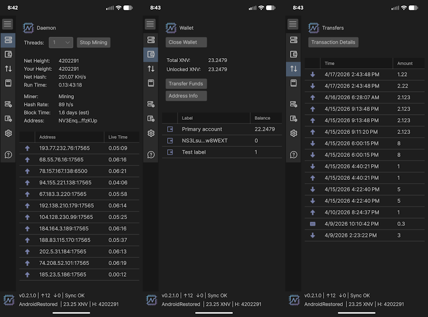
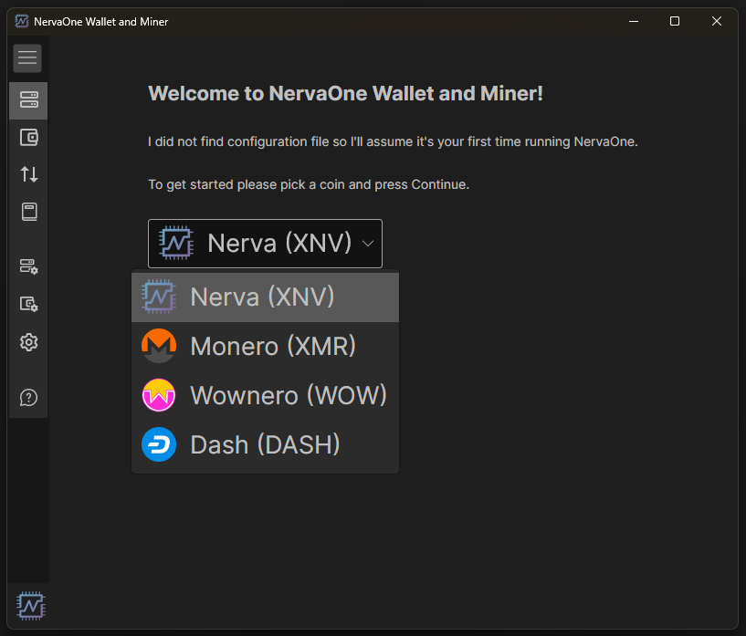
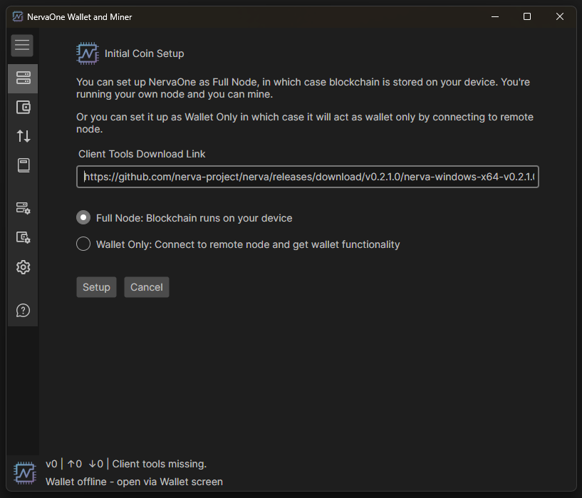
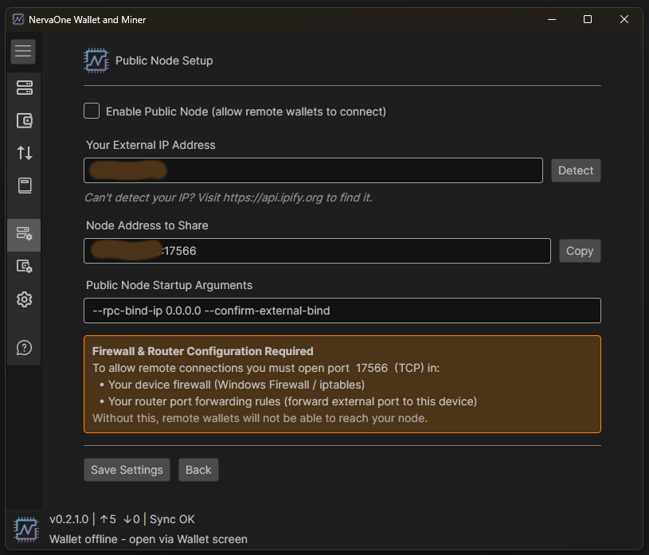

# NervaOne Guide
NervaOne is a new, modern GUI application. It's a multi-coin, open source wallet and CPU miner that currently supports Nerva, Monero, Wownero and Dash. More coins might be added in the future. This is a non-custodial wallet. You either run client tools on your own device or connect to a remote node.

## Screenshots

Daemon view on Desktop. You control mining from here:

Daemon, Wallet and Transfers views on Android

## Downloading

Binary distributions can be found [here][nerva-downloads-link].

Select the appropriate file for the target platform (Windows, Linux, macOS, or Android).

## Installing on Desktop

There is nothing to install. You just download the zip file, extract it and run the application!

## Installing on Android

Download the APK from [the downloads page][nerva-downloads-link] and install it on your device. You may need to allow installation from unknown sources in your Android settings.

NervaOne on Android supports both full node mode and wallet-only mode. If you're on a mobile connection or have limited storage, wallet-only mode connecting to a remote node is recommended.

## Starting up NervaOne for the first time

First time you run NervaOne, it will ask you to select coin. Select Nerva (XNV) and press OK:

After that, you choose if you want to run Full Node or Wallet Only.

If you chose to run as Full Node, it will give an option to change client tools download link and once you confirm, it will download, extract and start nervad.

## Full Node vs Wallet-Only Mode (Remote Node)

You can run as full node, blockchain and Nerva core software runs on your device. This also allows you to mine.

If you don't want to run a full local node, you can connect to a remote node and use NervaOne purely as a wallet. This skips syncing the blockchain on your device. Note that mining is not available in wallet-only mode.

After initial setup, if you want to switch between Full Node and Wallet Only, go to: Daemon Setup and you'll see an option to change there.

## Creating a Wallet / Restoring a Wallet

To create a new wallet, go to: Wallet Setup > Create New Wallet

To restore an existing wallet from keys or seed go to: Wallet Setup > Restore Wallet from Seed or Restore Wallet from Keys

## Opening a Wallet

Go to: Wallet > Open Wallet. A dialog will pop up and it will display available wallets.

## Exporting Keys

Each NERVA wallet is, essentially, just a string of 25 words from which the public address is derived.

It is **very** important to export these keys and back them up somewhere that is safe and secure (meaning somewhere reliable/permanent that no one else can access).

In the event of a lost or corrupted wallet file, computer crash, etc., the 25 word mnemonic seed and Private Spend Key are the **only way** to restore a wallet and recover the funds it holds.

**DO NOT SHARE IT WITH ANYONE**. **Anyone who has these can *access your funds* and has *complete control* over your wallet.**

In NervaOne, go to Wallet Setup > View Keys and Mnemonic Seed

Wallet public and private keys as well as 25  word mnemonic seed will be displayed.

**Safely save and store these words and keys**

## Transferring funds

Go to: Wallet > Transfer Funds, provide required fields and press Transfer.

*If a payment id is provided, you **must** give it, otherwise you risk losing your funds!*

Enter your password if asked and press OK.

Your transaction should now be on the way to the recipient's wallet!

## Moving Wallet to Another Device

If you'd like to move your wallet to another device, you can just copy wallet files.

Go to: Wallet Setup and click "Open Wallets Folder". Copy the wallet that you want to move and paste it to the same folder on another device.

Make sure you copy both .cache and .keys files or your wallet might not open properly.

## Exiting the Wallet

To exit NervaOne, simply click X on the top.

## Running a Public Node

Running a public node allows other users, or your own instance of NervaOne on Android to connect to your node in wallet-only mode. You can set it up under Daemon Setup > Public Node Setup. After you're done, two additional things are required: opening the port in your firewall, and setting up port forwarding on your router.

**Step 1 — Firewall**

Open port **17566** as an inbound rule in your system firewall. On Windows this is done through Windows Firewall; on Linux via `ufw` or `iptables`; on macOS through System Settings > Network. Without this, your node will not accept incoming connections even if port forwarding is configured.

**Step 2 — Find your internal IP**

Find your internal IPv4 address — run `ipconfig` on Windows, or `ip addr` / `ifconfig` on Linux and macOS. You'll need this for the port forwarding rule.

**Step 3 — Router port forwarding**

Log in to your router and add a port forwarding rule for port **17566** pointing to your internal IP address. Note that some ISPs (such as Xfinity/Comcast) do not expose port forwarding in the router admin interface — you may need to set it up through your ISP's app instead.

Once both steps are done, your node will be reachable from outside your network.

## libhidapi library missing in macOS
If your nervad does not start on macOS because you get error similar to this:

dyld(9313): Library not loaded: '/usr/local/opt/hidapi/lib/libhidapi.0.dylib'
Referenced from: '....nervad'
Reason: tried '....libhidapi.0.dylib' (no such file)

Try fix from [here][macos-library-error].

Those should be the commands that you need to run:

`brew update`

`brew reinstall hidapi`

If you do not have homebrew, you'll need to install it from [here][homebrew].

## How to set up NervaOne on a computer that does not support AES

* When first starting NervaOne and after you select Nerva (XNV), change default client tools download link to non-minimal version: https://github.com/nerva-project/nerva/releases/download/v0.1.8.0/nerva-v0.1.8.0_windows.zip
* Go to Daemon Setup and click "Open Client Tools Folder"
* Exit NervaOne and kill nervad in task manager if it's running
* In that cli folder, rename nervad.exe to something else and after that rename nervad-noaes.exe to nervad.exe
* Start NervaOne

NervaOne should now use non-aes version of nervad and you should be able to mine.

NOTE: You will not be able to create/open wallet in non-aes version

<!--Reference links -->
[nerva-downloads-link]: https://nerva.one/#downloads
[macos-library-error]: https://dede.dev/posts/Fixing-Library-not-loaded-Error-on-macOS/
[homebrew]: https://brew.sh/
