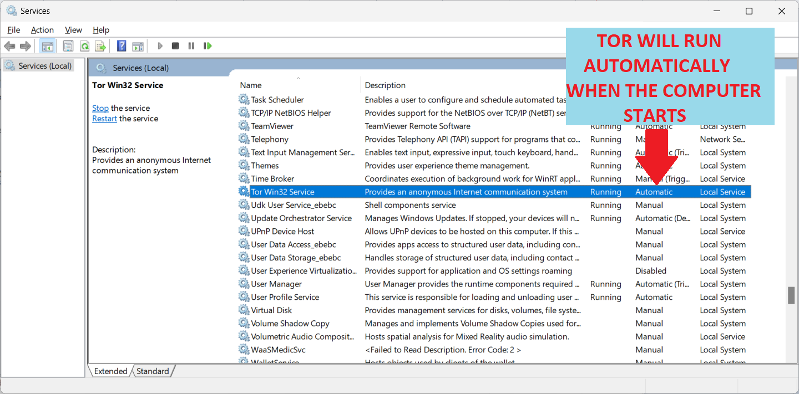

# Nerva Tor Guide
This explains how to run the Nerva daemon so that outgoing transactions are broadcast through the Tor anonymity network, instead of directly from your IP address. This helps protect your network identity when sending transactions.

Tor is used only for transaction broadcasting. The normal peer-to-peer sync traffic uses your regular network connection.

# Windows Setup

Download the [Tor Expert Bundle][tor-expert]  (not the Tor Browser)

The file is in tar.gz format.  extract the contents.  these instructions assume you extracted to `C:\Tor\` so that tor.exe is located at `C:\Tor\tor\tor.exe`

Make a directory `C:\Tor\logs`

Create a file named "torrc" (no extension) in C:\Windows\ServiceProfiles\LocalService\AppData\Roaming\tor
with the following contents:

    SocksPort 9050
    DataDirectory C:\Tor\data
    Log notice file C:\Tor\logs\notice.log

Open a command prompt as Administrator and run these commands one at a time:

    cd \Tor\tor
    tor --service install

If successful you will see:

    "Service installed successfully"
    and
    "Service started successfully"

To verify Tor is running, check the log file at `C:\Tor\logs\notice.log`

The last line should read: "Bootstrapped 100% (done): Done"

The Tor service will start automatically every time Windows boots.

    To stop the service:    `tor --service stop`
    To start the service:   `tor --service start`
    To remove the service:  `tor --service remove`

This will remove Tor service from running at system startup.

You can also run services.msc and see that Tor is set to run automatically.

## Launch Nerva Daemon with Tor

Open a Command Prompt and change directoy to where Nerva software is.

    Run: `nervad --tx-proxy tor,127.0.0.1:9050,100`

NOTE: Also include any other flags you want, like data directory and log file locations, etc.

Wait for the daemon to display:

    SYNCHRONIZED OK
    and
    You are now synchronized with the network. You may now start nerva-wallet-cli.

## Send Transaction Over the Tor Network

Open a second Command Prompt and launch the wallet:

    nerva-wallet-cli.exe

Send your transaction as normal.

To verify the transaction went through Tor:

    Check the daemon log file or terminal output for a line similar to:
    Transaction added to pool: txid <...hash...>

This confirms the transaction was accepted by your daemon and broadcast to the network.
Because the daemon was launched with `--tx-proxy tor,127.0.0.1:9050,100` the broadcast was routed through the Tor proxy on port 9050.

You can also verify Tor is active by checking `C:\Tor\logs\notice.log` and confirming "Bootstrapped 100% (done): Done" is shown at the bottom of the log.

### NOTE

The website [check.torproject.org][tor-project] will show "You are not using Tor" when checked from your browser. This is EXPECTED and CORRECT. Tor is running as a SOCKS5 proxy, not a VPN. Only applications configured to use port 9050 route through Tor. Your browser is not one of them unless separately configured.

### IMPORTANT SIDE NOTE ON ANALYTICS

The Nerva daemon sends analytics data to the node map at 74.208.52.101 over plain HTTP. This traffic is NOT routed through Tor and may expose your IP address. You can disable analytics by launching the daemon with the `--no-analytics` flag.

[tor-expert]: https://www.torproject.org/download/tor/
[tor-project]: https://check.torproject.org/