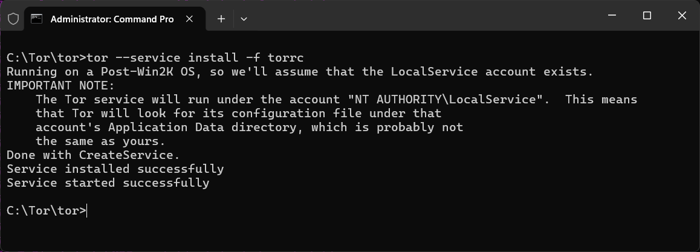
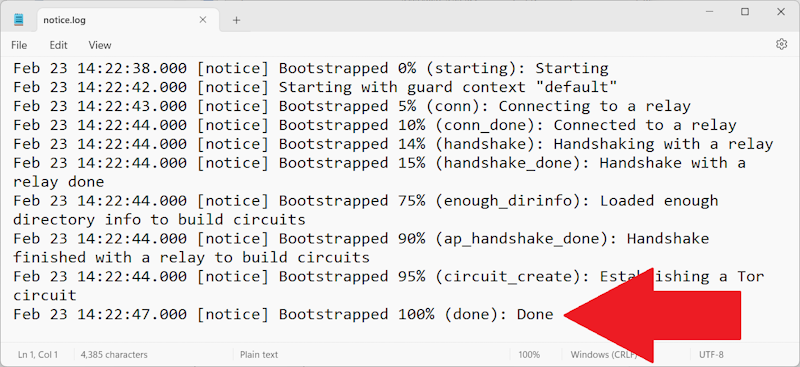
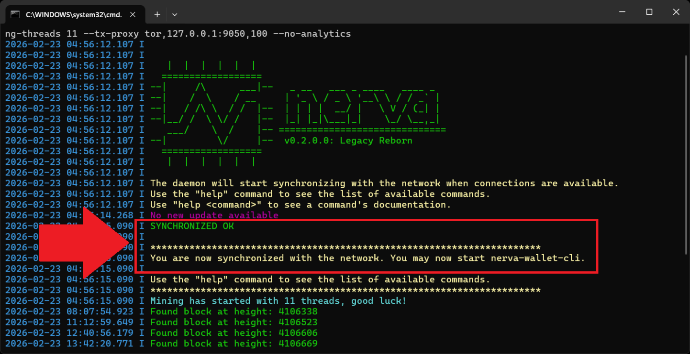
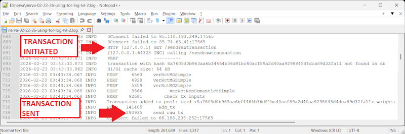

# Nerva Tor Guide
This explains how to run the Nerva daemon so that outgoing transactions are broadcast through the Tor anonymity network, instead of directly from your IP address. This helps protect your network identity when sending transactions.

Tor is used only for transaction broadcasting. The normal peer-to-peer sync traffic uses your regular network connection, which keeps the node fast to sync and makes surrounding the daemon with sybil peers harder. The same mechanism works with I2P if you prefer it, using `--tx-proxy i2p,...` instead of the Tor examples below.

The feature is inherited from upstream and still considered experimental: it is believed to improve privacy of the transaction origin, but it is not a magic anonymity box. The limitations section at the end describes what it does and does not protect against, and is worth reading before relying on it.

# Installing Tor

## Windows

Download the [Tor Expert Bundle][tor-expert] (not the Tor Browser).

The file is in tar.gz format. Extract the contents. These instructions assume you extracted to `C:\Tor\` so that tor.exe is located at `C:\Tor\tor\tor.exe`.

Make a directory `C:\Tor\logs`.

Create a file named "torrc" (no extension) in C:\Windows\ServiceProfiles\LocalService\AppData\Roaming\tor
with the following contents:

    SocksPort 9050
    DataDirectory C:\Tor\data
    Log notice file C:\Tor\logs\notice.log

Open a command prompt as Administrator and run these commands one at a time:

    cd \Tor\tor
    tor --service install

If successful you will see:

    "Service installed successfully"
    and
    "Service started successfully"

The Tor service will start automatically every time Windows boots.

    To stop the service:    `tor --service stop`
    To start the service:   `tor --service start`
    To remove the service:  `tor --service remove`

To verify Tor is running, check the log file at `C:\Tor\logs\notice.log`. The last line should read "Bootstrapped 100% (done): Done".

## Linux

On Debian and Ubuntu the packaged Tor is all that is needed:

    sudo apt install tor

The service starts automatically and listens for local SOCKS connections on 127.0.0.1:9050, which is exactly what the daemon expects. Most desktop and server distributions carry Tor in their repositories; on others, follow the [Tor Project's Linux instructions][tor-linux].

## macOS

With Homebrew installed:

    brew install tor
    brew services start tor

That gives you a Tor service in the background with a SOCKS port on 127.0.0.1:9050. Without `brew services` you can also run `tor` directly in a terminal whenever you need it.

# Broadcasting transactions over Tor

Launch the daemon with:

    nervad --tx-proxy tor,127.0.0.1:9050,100

The general form is `--tx-proxy <network>,<socks-ip:port>[,max_connections]`, so this tells nervad that .onion peers can be reached through the SOCKS proxy Tor exposes on 127.0.0.1:9050, with up to 100 outgoing connections through it. Any other daemon flags you normally use can be added as usual.

Wait for the daemon to display:

    SYNCHRONIZED OK
    and
    You are now synchronized with the network. You may now start nerva-wallet-cli.

Open a second terminal and launch the wallet:

    nerva-wallet-cli

Send your transaction as normal.

To verify the transaction went through Tor, check the daemon log file or terminal output for a line similar to:

    Transaction added to pool: txid <...hash...>

This confirms the transaction was accepted by your daemon and broadcast to the network. Because the daemon was launched with `--tx-proxy tor,127.0.0.1:9050,100`, the broadcast was routed through the Tor proxy on port 9050 rather than out of your own address.

# Accepting connections over Tor

The setup above only sends. If you also want your node to be reachable as a Tor peer, configure Tor to run a hidden service that forwards to the daemon's peer to peer port. Add to your torrc:

    HiddenServiceDir /var/lib/tor/data/nerva
    HiddenServicePort 17565 127.0.0.1:17565

On Windows the hidden service directory can live under `C:\Tor\data\` instead. After restarting Tor, the file `hostname` inside the hidden service directory contains your .onion address. Tell the daemon about it:

    nervad --tx-proxy tor,127.0.0.1:9050,100 --anonymous-inbound <youraddress>.onion:17565,127.0.0.1:17565,25

This tells nervad that up to 25 inbound Tor connections arrive at that onion address and are forwarded by Tor to localhost port 17565. The daemon shares the address with its Tor peers so they can pass it on.

There are no seed nodes on the Tor network, so to actually meet peers over Tor you have to name at least one yourself, either someone else's onion address or your own:

    --add-peer <address>.onion:17565

The two can be mixed freely with regular IPv4 peers. Only handshakes, timed syncs and transaction broadcasts travel over the anonymity network; everything else, including block sync, stays on your regular connection.

# Pointing a wallet at a daemon over Tor

The wallet can also reach a daemon through Tor, which is useful if the daemon runs somewhere else and you do not want to expose its RPC to the clearnet, or if you use someone else's onion service. Give the wallet a proxy and an onion address:

    nerva-wallet-cli --proxy 127.0.0.1:9050 --daemon-address <address>.onion

For this to work, the daemon being contacted must expose its RPC port as a hidden service too, which is configured separately from the peer to peer one:

    HiddenServiceDir /var/lib/tor/data/nerva-rpc
    HiddenServicePort 17566 127.0.0.1:17566

The same `--proxy` and `--daemon-address` options apply to `nerva-wallet-rpc`. The proxy must match the address type: a Tor proxy will not reach an I2P address and the other way around. Onion addresses authenticate the endpoint on their own, so no certificate handling is needed unless you deliberately add SSL on top.

# Limitations

Some honest words about what this does and does not achieve.

Only transaction broadcasting goes over Tor. Your daemon still syncs the blockchain from regular peers, who see your IP address, and transactions you receive are scanned like anywhere else. What improves is the origin of the transactions you send: they enter the network from a Tor exit rather than from you.

A few weaknesses remain. The peer timed sync messages carry your system time, and a peer that sees you on both Tor and clearnet could try to link the two connections if your clock is off, so keep your system clock accurate. Running the daemon only when you want to send is itself a pattern an ISP could correlate, so leave it running when you can. And a single Tor stream reused for several transactions can let a hidden service operator conclude the transactions share an origin; the daemon rotates its selected Tor connections every few minutes to reduce this, but cannot eliminate it.

In short: this raises the bar considerably for passive observers, but a determined adversary with a global view is not ruled out by Tor alone. If your threat model includes one, read up on traffic analysis before trusting any single layer.

# A note on analytics

The daemon reports basic node information to the Nerva node map, and the address it reports to is currently served over plain HTTP (it is looked up in the `analytics.nerva.one` DNS record). This traffic is not routed through Tor and may expose your IP address. You can disable it by launching the daemon with the `--no-analytics` flag, or by turning analytics off in NervaOne's daemon settings.

### NOTE

The website [check.torproject.org][tor-project] will show "You are not using Tor" when checked from your browser. This is EXPECTED and CORRECT. Tor is running as a SOCKS5 proxy, not a VPN. Only applications configured to use port 9050 route through Tor. Your browser is not one of them unless separately configured.

<!--Reference links -->
[tor-expert]: https://www.torproject.org/download/tor/
[tor-linux]: https://community.torproject.org/onion-services/setup/
[tor-project]: https://check.torproject.org/
