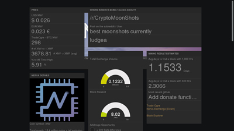
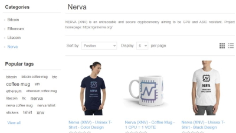

# Community Projects
A list of community projects and initiatives is hosted here. This page is not exhaustive and does not cover the projects in active development. If you're working on something related to NERVA, be sure to let us know on [Discord][nerva-discord-link].

### Nerva Tools 

Mirror of current Nerva projects, by **syzygy** [Nerva Tools][nerva-tools-link]

### Nerva Stats (Freeboard)

Live network statistics, by **xmranon** [https://freeboard.io/board/EV5-se][freeboard-link]

### Nodemap

A map of NERVA full nodes around the world with stats, by **syzygy** [Nerva node map][nerva-nodemap-link]

### M4Crypto Store

Merchandise store that sells NERVA gear and accepts payment in NERVA by **R0BC0D3R** [M4Cryto Store][m4crypto-link]

# Graveyard
Sometimes projects cease development and the people behind them move on to other things. Fortunately in many cases, the code is released by the author so that others can make use of it. Here are some examples.

### Forkmaps Benchmarks
A selection of NERVA mining benchmarks, by **JerMe404**

### Nerva Store Project

Proof-of-concept online store that accepts payment in XNV, by **ukminer**

#### Nerva.Exchange
An easy way to buy XNV with BTC, by **Nithronium** The code is available [on GitHub][nithronium-exchange-link].

#### YasLabs
- A calculator for NERVA mining profitability: [https://gitlab.com/yas3/nerva-calculator][yas3-calculator-link]
- A faucet for free XNV coins: [https://gitlab.com/yas3/nerva-faucet][yas3-faucet-link]
- A dice game played with XNV: [https://gitlab.com/yas3/nerva-games][yas3-games-link]

<!--Reference links -->
[nerva-nodemap-link]: https://map.nerva.one/
[nerva-discord-link]: https://discord.gg/ufysfvcFwe

[nerva-tools-link]: https://nerva.tools/
[freeboard-link]: https://freeboard.io/board/EV5-se
[m4crypto-link]: https://m4crypto.com/

[nithronium-exchange-link]: https://github.com/nithronium/Nerva.Exchange
[yas3-calculator-link]: https://gitlab.com/yas3/nerva-calculator
[yas3-faucet-link]: https://gitlab.com/yas3/nerva-faucet
[yas3-games-link]: https://gitlab.com/yas3/nerva-games