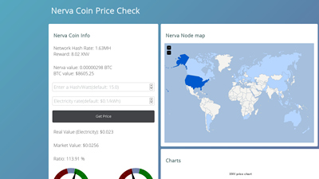
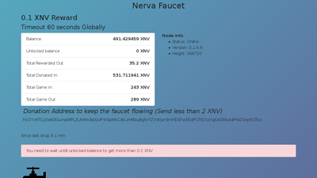

# Community Projects
Pending a redesign of the main website, a list of community projects and initiatives is listed here.
 
### Nerva Stats (freeboard)

Live network statistics, by **xmranon**

Link: [https://freeboard.io/board/EV5-se](https://freeboard.io/board/EV5-se)
  
### Nodemap

A map of NERVA full nodes around the world with stats, by **syzygy**

Link: [https://nerva.syzygy.cc](https://nerva.syzygy.cc)
  
### Nerva Store Projects

Proof-of-concept online stores that accept payment in XNV.

**By ukminer:** [https://nervashop.com/](https://nervashop.com/) 
**By yas:** [https://store.yaslabs.com/](https://store.yaslabs.com/)
  
### Mining Calculator

Calculate NERVA mining profitability, by **yas** 
Link: [https://webapp.yaslabs.com/](https://webapp.yaslabs.com/)
  
### Nerva Faucet

A faucet for free coins, by **yas**

Link: [https://store.yaslabs.com/faucet/](https://store.yaslabs.com/faucet/)
  
### Nerva.Exchange (defunct)
An easy way to buy XNV for BTC, by **Nithronium**.

The code is available [on GitHub](https://github.com/nithronium/Nerva.Exchange).