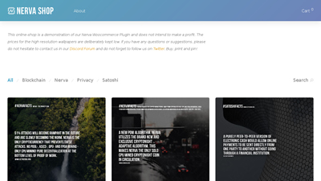

# Community Projects
Pending a redesign of the main website, a list of community projects and initiatives is hosted here. This page is not exhaustive and does not cover the projects in active development such as JerMe404's web and mobile wallet. If you're working on something related to NERVA, be sure to let us know in the **#community-projects** channel on Discord.

### Nerva Stats (Freeboard)

Live network statistics, by **xmranon**. [https://freeboard.io/board/EV5-se](https://freeboard.io/board/EV5-se)
  
### Nodemap

A map of NERVA full nodes around the world with stats, by **syzygy**. [https://nerva.syzygy.cc](https://nerva.syzygy.cc)
  
### Nerva Store Project

Proof-of-concept online store that accepts payment in XNV, by **ukminer**. [https://nervashop.com/](https://nervashop.com/) 
  
### Forkmaps Benchmarks
A selection of NERVA mining benchmarks, by **JerMe404**. [https://forkmaps.com/#/benchmarks](https://forkmaps.com/#/benchmarks)

## Graveyard
Sometimes projects cease development and the people behind them move on to other things. Fortunately in many cases, the code is released by the author so that others can make use of it. Here are some examples.

### Nerva.Exchange
An easy way to buy XNV with BTC, by **Nithronium**. The code is available [on GitHub](https://github.com/nithronium/Nerva.Exchange).

### YasLabs
A calculator for NERVA mining profitability: [https://gitlab.com/yas3/nerva-calculator](https://gitlab.com/yas3/nerva-calculator)

A faucet for free XNV coins: [https://gitlab.com/yas3/nerva-faucet](https://gitlab.com/yas3/nerva-faucet)

A dice game played with XNV: [https://gitlab.com/yas3/nerva-games](https://gitlab.com/yas3/nerva-games)
